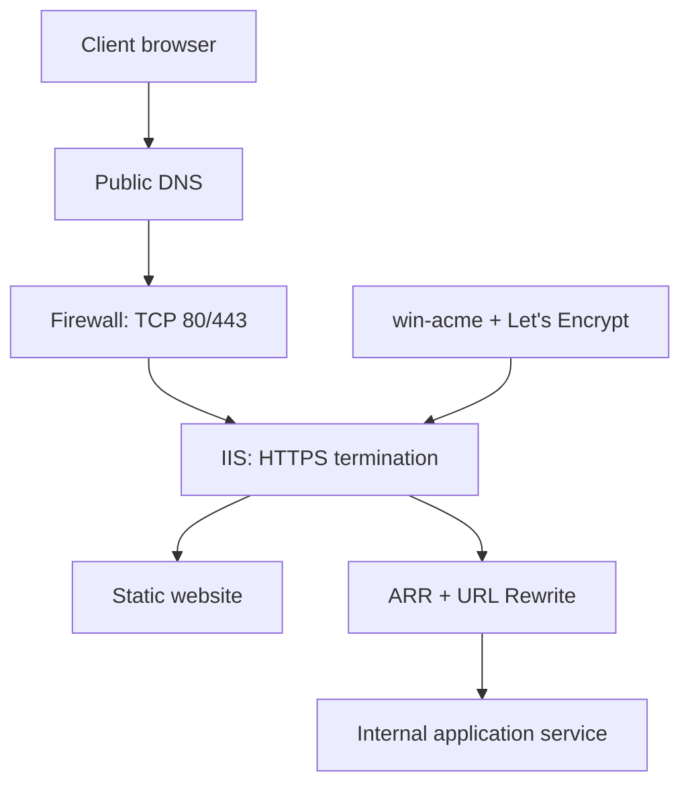

# 🔐 Secure IIS & Reverse Proxy

A practical Windows/IIS project showing how to publish a website securely, issue and renew a trusted TLS certificate with win-acme and Let's Encrypt, force HTTPS, enable HSTS, and place IIS in front of an application service with Application Request Routing (ARR).

> [!NOTE]
> This repository uses example domains, IP addresses, and backend ports. Replace them with values from your environment.

**Start here:** [IIS setup](docs/01-iis-website-setup.md) → [HTTPS](docs/02-https-win-acme.md) → [Redirect and HSTS](docs/03-redirect-hsts.md) → [Reverse proxy](docs/04-reverse-proxy.md) → [Testing](docs/05-testing-troubleshooting.md)

## 🎯 Project objectives

- Install and verify Microsoft Internet Information Services (IIS).
- Publish a website with a domain-based HTTP binding.
- Obtain and install a Let's Encrypt certificate through win-acme.
- Redirect every HTTP request to HTTPS.
- Enable HSTS after HTTPS has been verified.
- Use IIS, URL Rewrite, and ARR as a reverse proxy.
- Verify certificate renewal, bindings, redirects, headers, and upstream connectivity.
- Document common failures and safe troubleshooting steps.

## ✨ Core features

| Capability | Implementation |
|---|---|
| Web server | Microsoft IIS |
| TLS certificate | Let's Encrypt through win-acme |
| Domain validation | ACME HTTP-01 |
| Secure binding | HTTPS on TCP 443 |
| HTTP upgrade | IIS URL Rewrite with a permanent 301 redirect |
| Transport policy | HSTS response header |
| Reverse proxy | IIS ARR + URL Rewrite |
| Renewal | win-acme scheduled task |
| Validation | Browser, PowerShell, IIS bindings, Task Scheduler and logs |

## 🏗️ System architecture

IIS is the public entry point. It serves website files directly or forwards selected requests to an internal service. Let's Encrypt validates control of the hostname, while win-acme installs the certificate, creates the IIS binding, and schedules renewal.

## 🗺️ Documentation map

| Guide | Purpose |
|---|---|
| [Architecture](docs/architecture.md) | Components, request path, ports, and trust boundaries |
| [IIS website setup](docs/01-iis-website-setup.md) | Install IIS, create the site, configure DNS and bind port 80 |
| [HTTPS with win-acme](docs/02-https-win-acme.md) | Issue, install, verify, and renew the certificate |
| [HTTPS redirect and HSTS](docs/03-redirect-hsts.md) | Force HTTPS and add Strict Transport Security safely |
| [ARR reverse proxy](docs/04-reverse-proxy.md) | Forward requests from IIS to an internal backend |
| [Testing and troubleshooting](docs/05-testing-troubleshooting.md) | Validation commands, logs, symptoms, and corrective checks |
| [Example web.config](examples/web.config.example) | Reusable redirect, proxy, and security-header rules |

## 🚀 Implementation order

1. Point the domain's DNS record to the server.
2. Allow inbound TCP 80 and 443 at the edge firewall and Windows Firewall.
3. Install IIS and create the website.
4. Confirm the site works over HTTP.
5. Run win-acme as Administrator and request a certificate for the IIS site.
6. Confirm the HTTPS binding and certificate.
7. Install URL Rewrite and configure HTTP-to-HTTPS redirection.
8. Confirm HTTPS is stable, then enable HSTS.
9. If an application service is used, install ARR and configure the reverse proxy.
10. Test externally and verify automatic renewal.

## ✅ Success criteria

- The hostname resolves to the intended public address.
- HTTP reaches IIS and returns a permanent redirect to HTTPS.
- HTTPS loads without a certificate warning.
- The certificate hostname and validity period are correct.
- IIS has an HTTPS binding on port 443.
- The HSTS header is returned only after HTTPS is working reliably.
- Proxied routes reach the intended backend without exposing its listener publicly.
- The win-acme renewal task exists and a renewal test succeeds.

## 🔒 Security notes

- Never commit private keys, exported certificates, passwords, production IP addresses, or internal hostnames.
- Keep the backend bound to localhost or a private interface where possible.
- Restrict backend ports with Windows Firewall.
- Enable HSTS only after HTTPS is confirmed; `includeSubDomains` affects every subdomain.
- Back up IIS configuration before major changes.
- Treat a reverse proxy as one security layer, not a replacement for securing the backend.

## 📚 Technologies

Microsoft IIS · IIS URL Rewrite · Application Request Routing · win-acme · Let's Encrypt · Windows Firewall · DNS · TLS

## 👤 Author

**Ogemade Folarin Solomon**
