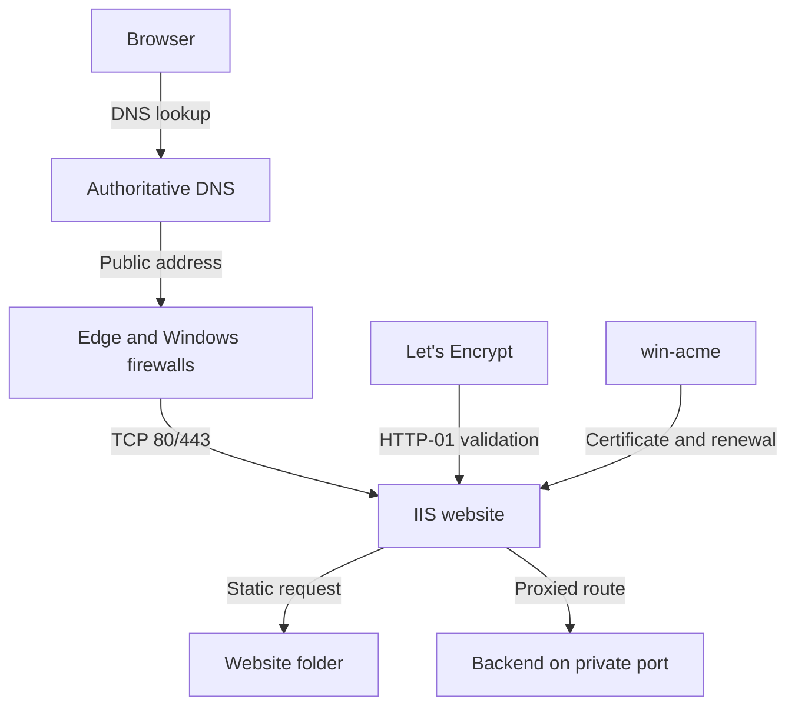

# 🏗️ Architecture

## Overview

The design separates the public web boundary from the application service. Public clients connect only to IIS on ports 80 and 443. IIS terminates TLS, applies redirect and security rules, serves static content, or proxies a request to an internal backend.

## Component responsibilities

| Component | Responsibility |
|---|---|
| DNS | Maps the public hostname to the server's public address |
| Firewall/NAT | Allows TCP 80/443 and prevents direct public access to the backend |
| IIS website | Owns host bindings, serves content, terminates TLS, redirects HTTP and emits headers |
| URL Rewrite | Matches requests and selects redirect or proxy actions |
| ARR | Enables IIS to forward matched requests to an upstream service |
| win-acme | Automates ACME validation, certificate installation, IIS binding and renewal |
| Let's Encrypt | Validates domain control and signs the public certificate |
| Backend | Runs the application on localhost or a private interface |

## Request paths

### HTTPS website request

1. The client resolves `example.com`.
2. The firewall sends TCP 443 traffic to IIS.
3. IIS presents the certificate and completes TLS.
4. IIS serves the requested static file.

### HTTP request

1. The client connects on TCP 80.
2. The IIS redirect rule checks `{HTTPS}`.
3. IIS returns `301 Location: https://...`.
4. The client reconnects securely on TCP 443.

### Proxied application request

1. The client connects to IIS over HTTPS.
2. URL Rewrite matches the configured route.
3. ARR forwards the request to `http://127.0.0.1:8080` or another private listener.
4. The backend response returns through IIS to the client.

## Port model

| Port | Exposure | Purpose |
|---|---|---|
| 80/TCP | Public | ACME HTTP-01 and redirect to HTTPS |
| 443/TCP | Public | Production HTTPS endpoint |
| Backend port | Local/private only | Communication from IIS to the application |

The example backend port is not a requirement. Use the port on which the actual application listens, and keep it inaccessible from the public internet.
